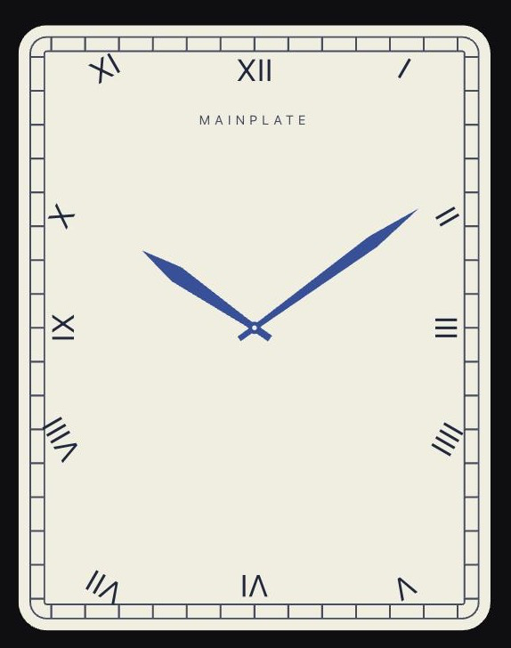

# mainplate

Declarative React primitives for analog instrument faces. A speedometer, a
clock, and a power reserve indicator are the same component with different
numbers in it.

> **Status: core, time, and examples — not published.** What exists: the
> geometry, the frame, the outlines, the full primitive set — `<Dial>`,
> `<Ticks>`, `<Numerals>`, `<Hand>`, `<Arc>`, `<Subdial>`, `<Place>` — the
> time layer (`useWatchSource`, glide/tick cadence, reduced-motion and
> offscreen handling), and four packaged example faces. What does not exist
> yet: a docs site and a registry, so there is nothing to install — no package
> on npm; the import path below is the in-repo alias.

## The idea

Most circular-UI libraries have one concept where there are really two.

- The **frame** is the angular coordinate system. Given a value, what angle?
- The **outline** is the closed path marks sit on. Given an angle, where is the
  edge?

On a round watch these coincide, so collapsing them into one costs nothing —
which is why almost every library does. On a Cartier Tank they do not, and that
is the reason no existing library can draw a railway minute track on a
rectangle. Separating them is the whole point of this library.

```tsx
import { Mainplate, Ticks } from "@/mainplate/core"

const TANK = { kind: "rect", ratio: 0.78, radius: 12 } as const

export default function Face() {
  return (
    <Mainplate size={260} max={60} outline={TANK}>
      <Ticks count={60} inset={9} length={6} width={0.6} orient="edge" align="inside" />
    </Mainplate>
  )
}
```

Position comes from the frame, so the mark at 15 is still straight right, exactly
where it would be on a circle. Orientation comes from the outline, so every mark
stands perpendicular to the edge it sits on rather than pointing at the centre.
Their spacing along the perimeter is therefore uneven, which is correct — the
angles are evenly spaced, the perimeter is not.



That face is the packaged Tank example (`src/mainplate/examples/tank.tsx`,
live at `/lab/tank`): sixty ties divided evenly by arc length between two
rails that are the outline itself, and Roman numerals set radially off the
same case so the hands still point at them.

That claim is a test file rather than an assertion:
`src/mainplate/core/thesis.test.tsx` pins uneven perimeter spacing, preserved
angular correspondence, edge-perpendicular orientation, `edge` and `radial`
diverging on a rectangle and converging on a circle, and the resulting path data.

The `outline` above is a plain object because an `Outline` is made of closures,
and functions cannot cross the React Server Component boundary. Descriptors and
the string forms `"circle"` and `"rect"` work anywhere; `circleOutline()` and
`rectOutline()` build the real thing once you are inside `"use client"`.

## The primitives

- **`<Mainplate>`** — the root `<svg>`: establishes the frame (domain, sweep,
  outline) every other primitive reads from context.
- **`<Dial>`** — the surface: the outline's own shape, filled. Fill-only by
  type; a stroked ring is a full-sweep `<Arc>`.
- **`<Ticks>`** — the marks: populated by `count`, an explicit `ticks` array,
  or multi-track `tiers`, merged into as few `<path>` nodes as the paint allows.
- **`<Numerals>`** — the numbers: same population pipeline as `<Ticks>`, plus
  a clearance solver — `track` + `clearance` place each label so its optical
  ink holds the same shortest distance from the tick track, whatever the
  label's width or angle.
- **`<Hand>`** — the pointer. `value` takes a number (controlled, pure) or a
  `Source` (live: the hand subscribes and writes `style.rotate` through a ref,
  zero React renders per update). Local `min`/`max`/`startAngle`/`sweepAngle`
  override the frame per hand — a clock is three hands with three domains.
- **`<Arc>`** — the library's only stroked path: bezels, rails, redlines, gauge
  fills. `from`/`to` are domain values or `Source`s; `r` draws a circle,
  `inset` traces the outline's own shape.
- **`<Subdial>`** — a dial inside a dial: re-establishes the frame at a scaled
  origin, so every primitive works inside it unchanged with its own domain.
- **`<Place>`** — the escape hatch: arbitrary SVG children positioned at an
  angle, a clock position (`at="9h"`), or a point.

A complete face, from the working chronograph at `www/app/lab/face/page.tsx`
(run it with `bun run dev`, then `/lab/face`). Trimmed by whole elements only —
the full face adds a second register at 3 o'clock, a redline band, a 6 o'clock
legend, and the centre caps; every element below is otherwise identical to the
lab code:

```tsx
"use client"

import { useEffect } from "react"
import { Arc, createSource, Dial, Hand, Mainplate, Numerals, Place, Subdial, Ticks } from "@/mainplate/core"

const elapsed = createSource(0, { min: 0, max: 60 })

const PLATE = "oklch(0.21 0.006 285)"
const EDGE = "oklch(0.34 0.008 285)"
const FAINT = "oklch(0.48 0.01 285)"
const MID = "oklch(0.72 0.01 285)"
const INK = "oklch(0.92 0.01 95)"
const ACCENT = "oklch(0.8 0.13 78)"
const WELL = "oklch(0.13 0.005 285)"

export function Chronograph() {
  // No animation primitives yet — a bare interval at tick cadence writes the
  // source, and the chrono hand and elapsed arc subscribe. Zero React renders.
  useEffect(() => {
    const id = setInterval(() => {
      elapsed.set((Math.round((elapsed.get() + 0.2) * 10) / 10) % 60)
    }, 200)
    return () => clearInterval(id)
  }, [])

  return (
    <Mainplate size={360} max={60} label="Chronograph, every primitive on one face">
      <Dial fill={PLATE} />

      <Ticks
        inset={4}
        align="inside"
        tiers={[
          { every: 1, length: 4, width: 0.8, fill: FAINT },
          { every: 5, length: 10, width: 2.2, fill: INK },
        ]}
      />

      {/* Solved: each label's ink holds exactly 3 dial units from the tick
          track. skip={[15, 45]}: the registers sit where those labels would
          land, and a subdial paints over anything drawn before it. */}
      <Numerals
        tiers={[{ every: 5 }]}
        from={5}
        to={60}
        skip={[15, 45]}
        track={{ r: 86, width: 2.2 }}
        clearance={3}
        fontSize={10}
        fill={MID}
      />

      {/* The elapsed ring: a static track, and a live fill whose `to` is the source. */}
      <Arc inset={1.5} strokeWidth={1.2} stroke={EDGE} />
      <Arc from={0} to={elapsed} inset={1.5} strokeWidth={1.2} stroke={ACCENT} />

      <Subdial at="9h" inset={50} r={26} min={0} max={60} label="Running seconds">
        <Dial fill={WELL} />
        <Ticks count={12} inset={5} length={9} width={2} align="inside" fill={FAINT} />
        <Hand value={42} length={80} tail={16} width={5} fill={INK} />
      </Subdial>

      <Place at="12h" inset={38} fill={INK}>
        <text fontSize={8.5} letterSpacing={1} textAnchor="middle" dominantBaseline="central">
          mainplate
        </text>
      </Place>

      {/* Hour and minute read 10:51 — the hour hand's local max={12} override
          maps 10.85 onto the same 0–60 frame the minute reads. */}
      <Hand value={10.85} max={12} length={50} tail={10} width={7} fill={INK} />
      <Hand value={51} length={76} tail={12} width={5} fill={INK} />
      <Hand value={elapsed} length={92} tail={22} width={1.8} fill={ACCENT} />
    </Mainplate>
  )
}
```

One rule the example leans on: **paint order is document order, and a subdial's
well is opaque** — a `<Subdial>` paints over anything rendered before it, and
nothing warns, because the library has no layout engine. Chapter-ring numerals
that land under a register would render half-hidden, which is why the
`skip={[15, 45]}` above omits the two labels where this face's registers sit
(45 under the running-seconds register kept here, 15 under the totaliser the
full lab face adds at 3 o'clock). `skip` takes domain values or a predicate;
reach for it whenever a face's own furniture collides.

## Time

The chronograph above never imports the time layer — a stopwatch is just a
`Source` someone writes. The wall clock is the packaged case:
`useWatchSource()` serves `hour`, `hour24`, `minute`, `second`, `ms` as five
stable `Source`s, each carrying its own domain — which is why the hour hand
below needs no `max={12}`; the source already knows. This component was run
exactly as written (Chrome, hands checked against the wall clock; it renders
once and never again while the clock runs):

```tsx
"use client"

import { Hand, Mainplate, Ticks } from "@/mainplate/core"
import { useWatchSource } from "@/mainplate/time"

export function Clock() {
  // Five Sources and an observe ref, created once — this component renders
  // once, and the hands move outside React from then on.
  const clock = useWatchSource({ second: "tick" })

  return (
    <Mainplate ref={clock.observe} size={220} min={0} max={60} label="A clock">
      <Ticks count={12} inset={4} length={8} width={2} />
      <Hand value={clock.hour} length={50} width={7} />
      <Hand value={clock.minute} length={76} width={5} />
      <Hand value={clock.second} length={88} tail={18} width={1.5} />
    </Mainplate>
  )
}
```

What the props don't show:

- **One engine per page.** Every `useWatchSource` shares one rAF loop through
  a lazy singleton ticker — twenty live faces cost one frame callback, not
  twenty.
- **`{ second: "tick" }` is the quartz step.** Cadence is a source option
  rather than a hand prop because only the scheduler can turn "once a second"
  into actually sleeping between boundaries — a tick-only face runs zero rAF
  and one timer per second. The default is `"glide"`, the sweep.
- **`ref={clock.observe}` is opt-in offscreen pausing.** Scrolled out of the
  viewport, this face releases the shared engine and resyncs to elapsed real
  time when it scrolls back — never a replay of the backlog. A hidden tab
  parks the engine the same way. Leave the ref off and the clock simply runs
  whenever the page is visible.
- **Reduced motion degrades, never freezes.** Under `prefers-reduced-motion`
  every glide hand steps once per second instead of sweeping. A stopped clock
  is a bug, not an accommodation.
- **On the server every field reads 10:09:36** — the time in every watch
  advertisement — so SSR output is deterministic and hydration never flakes.
- **`timezone` is an IANA zone resolved through `Intl`**, never a manual
  offset: DST breaks offset arithmetic twice a year.

## The examples

Four packaged faces live in `src/mainplate/examples/` — copyable source, not
a package — each built to prove a claim, with a scratch route to see it live
(`bun run dev`, then the path):

- **Speedometer** (`/lab/speedo`) — `core`-only, and CI enforces it: the
  boundary check fails if this file ever imports `time/`. A dashboard never
  pays for a clock.
- **Tank** (`/lab/tank`) — the thesis demo pictured above: a railway minute
  track dividing a rounded rectangle evenly by arc length, radial Roman
  numerals off the same outline.
- **Diver** (`/lab/diver`) — a live watch: the rotating bezel is a full-size
  second frame whose `startAngle` is the only thing a slider touches, applied
  indices are `renderItem` artwork, the power reserve is a subdial on its own
  0–1 domain and partial sweep, and three hands run off one `useWatchSource`.
- **Chronograph** (`/lab/chrono`) — three registers with three domains (60 s,
  30 min, 12 h), wall time and stopwatch on one face, and a tachymeter from
  the explicit `ticks` array — authored positions, computed labels.

They share `examples/theme.ts`: a `FaceTheme` of eight named paints,
`themeVars()` to spread them as `--mp-*` custom properties, and an OKLCH
gradient-stop helper — typed, demonstrated by all four, deletable.

## Theming, Tailwind, and dial units

Every primitive's paint defaults to `"currentColor"`, and `color` inherits
through SVG — so a single `color` on an ancestor themes an entire face:

```tsx
<div className="text-cyan-500">
  <Chronograph /> {/* every default-painted mark is now cyan */}
</div>
```

The one exception is `<Arc>`: it is the library's only stroked primitive, so
its themed paint is `stroke` (also defaulting to `currentColor`), and `fill`
is a compile error — SVG fills an open path as if closed by its chord, so a
"filled" arc would silently paint a chord segment.

One thing to know before reaching for Tailwind inside a face: within the
viewBox, a CSS `px` resolves to **one user unit, which is one dial unit** —
not one screen pixel. So `stroke-2` means 2% of the dial radius, and `text-sm`
means 14 dial units, whatever size the face renders at. That makes Tailwind's
**colour** utilities the right tool (they are unit-free) and its sizing scales
the wrong one — geometry belongs in props, which are dial units on purpose.

## HTML on a face

HTML does not go inside the SVG. The supported pattern is **layer
composition**: stacked absolutely-positioned `<Mainplate>` roots with ordinary
HTML between them in one `position: relative` container, so paint order is DOM
order — background face below, HTML in the middle, hands above. The HTML layer
is a sibling of the face and cannot call `useFrame()`, so `dialPercent` maps a
dial point to CSS `left`/`top` percentages, and `frameBox` gives the container
the face's aspect ratio. Pass them the same `outline`/`padding`/`clip` the
faces get, and the layers cannot disagree about geometry.

```tsx
const FACE = { outline: OUTLINE, clip: false, padding: 12 }

<div className="relative">
  <Mainplate {...FACE} size={320} className="absolute top-0 left-0">…</Mainplate>

  <div className="absolute inset-0">
    <Chip
      style={{
        position: "absolute",
        transform: "translate(-50%, -50%)",
        ...dialPercent(polar(45, 66), FACE),
      }}
    />
  </div>

  <Mainplate {...FACE} size={320} className="absolute top-0 left-0">
    <Hand value={45} />
  </Mainplate>
</div>
```

The working demo is `/lab/layers`. One caveat that matters on a real face: an
upper `<svg>` root is hit-testable across its **whole box**, not just where it
draws, so any layer above the one that handles input needs
`pointer-events-none` or it swallows every click.

Why not `<foreignObject>`: WebKit bug 23113 displaces any HTML inside it that
uses `position`, `transform`, `opacity < 1`, or a filter — which is most
components worth dropping on a dial. The findings and a working recipe are on
file in `fixtures/README.md` in case a future example genuinely needs it.

## Conventions

- **0° is twelve o'clock, and positive is clockwise.**
- **Dial units.** The nominal radius is 100 and the origin is the frame centre.
  On a non-circular outline, 100 is half the *minor* axis, so a Tank at
  `ratio: 0.78` is 200 dial units wide and about 256 tall.
- Angles are always degrees. Never radians.
- Nothing is measured in pixels. `size` is the one exception, because something
  eventually has to be.
- `value` is always a domain value; `at` is always a position. A mark's value
  is never falsified for aesthetics — nudge its `at` instead.
- `r` is frame-anchored (a circle, whatever the outline); `inset` is
  outline-anchored (follows the shape). Every primitive that anchors this way
  takes exactly one — the two exceptions are `<Subdial>`, whose `r` is its
  *size* in parent units (its anchor is `at` + `inset`, as in the example
  above), and `<Hand>`, which pivots at the centre and takes neither.

## Name

In horology the *mainplate* is the base plate every other component of a
movement mounts onto. Same idea here: the substrate a face is built on.

## Development

```bash
bun install
bun run dev     # dev harness at localhost:3000/lab
bun run check   # typecheck, www typecheck, lint, boundary check, tests
```

`bun run check` chains the same five steps CI runs. The boundary check
enforces the library's two structural rules: nothing in `core/` may import
from `time/`, and the speedometer example (theme included) may not either.

## Licence

MIT
